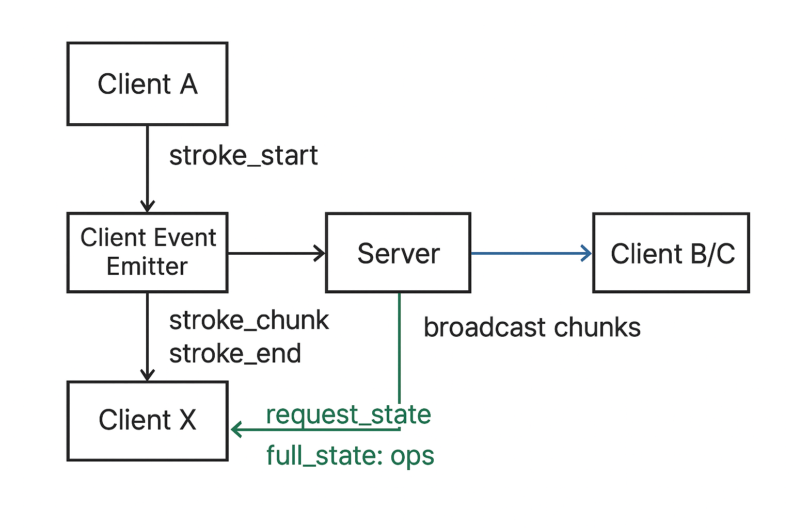

# ARCHITECTURE — Collaborative Canvas Prototype 📐🖌️

This document explains how the Collaborative Canvas works: data flow, WebSocket protocol, global undo/redo, performance trade-offs, conflict resolution — plus a visual diagram. Emojis and short callouts are used for quick scanning. Keep `ARCHITECTURE_DIAGRAM.png` in the repo root (it is referenced below).

---

## 🔁 1) High-level data flow — quick overview

Client (pointer events) → Server (authoritative) → Other Clients (render)

- Client emits: `stroke_start`, repeated `stroke_chunk`, `stroke_end`, and `cursor`.
- Server appends completed strokes into an in-memory ops list and broadcasts chunks to peers.
- Clients render chunks incrementally while drawing; on reconnect clients request `full_state` and replay ops.

ASCII summary:
Client A → Server → Client B/C  
Client X → request_state → Server → full_state (ops) → Client X

---

## 🖼️ Architecture diagram

The repository includes a PNG diagram for visual reference. It renders on GitHub/GitLab and other Markdown viewers.

Tip: open the image if you prefer a visual walkthrough of events, broadcasts and state requests.

---

## 🔌 2) WebSocket protocol — messages & payloads

Core messages (client ↔ server):

- join_room
  - client → server: { room: string, name: string }
- request_state
  - client → server: {}
  - server → client: { ops: [ op ] }  // full replayable list
- full_state
  - server → client: { ops: [ op ] }
- stroke_start
  - client → server: { id, color, width, tool?: 'pen'|'eraser' }
- stroke_chunk
  - client → server: { id, points: [{x,y}], color?, width? }
  - server → broadcast same to peers
- stroke_end
  - client → server: { id }  // finalize op
- undo / redo
  - client → server: {}
  - server → all: { type: 'undo'|'redo', opId? | op? }
- cursor
  - client → server: { x, y, id? }
  - server → broadcast: { id, x, y, color, name }

Op shape (recommended):
{ id: string, points: [{x,y}], color: string, width: number, removed?: boolean, createdAt?: number }

---

## 🔄 3) Undo / Redo strategy — global & deterministic

Design:
- Server maintains a linear ops array and a redo stack.
- Completed strokes become ops; undo marks the most recent non-removed op with `removed = true` and pushes it to redo stack.
- Redo pops from redo stack and restores `removed = false`.
- Server broadcasts undo/redo events; clients apply them and trigger a redraw.

Pros ✅: simple, deterministic, easy to reason about across multiple users.  
Cons ⚠️: not per-user undo — it's global.

---

## 🚀 4) Performance decisions — what & why

- Stream small point batches (stroke_chunk) for low-latency live rendering.
- Incremental rendering on clients — avoid full redraw on every incoming chunk.
- Tune batch size (e.g., 5–20 points) to balance bandwidth vs smoothness.
- Keep server hot-path minimal (append/broadcast) to maintain responsiveness.
- Memory-only ops for the prototype; consider snapshot + delta persistence for production to avoid long replay times.

Quick recommendation: if replay becomes slow, add periodic canvas snapshots + op delta trimming.

---

## 🤝 5) Conflict resolution — simultaneous drawing

- Single authoritative server serializes events in arrival order (server-time / FIFO).
- Concurrent strokes are preserved and layered by arrival order — no CRDT/merge semantics in this prototype.
- This is deterministic and simple; for richer semantics (per-user undo, intent merging) consider CRDTs or OT (more complex).

---

## 🔧 6) Troubleshooting & tips

- If clients look desynced: refresh one client (triggers `request_state`) or restart server (state in memory only).
- If stroke chunks are missing: check browser console for Socket.io errors and network packet drops.
- To test across devices: use the LAN URL printed on server start (server prints both localhost and network IP).

Server logging helper (recommended):
- Print both `localhost` and network address at server start so testers can connect via LAN.

---

## 📈 7) Improvements / roadmap ideas

- Persistence: snapshots + op deltas for long-lived rooms.
- Per-user undo using ownership metadata + CRDTs.
- Message acknowledgements for critical messages (`stroke_start`/`stroke_end`).
- Compression for point batches to reduce bandwidth.
- Room sharding and persistence for scale.

---

## 📝 Implementation notes — quick checklist

- Use UUIDs for stroke ids to avoid collisions.
- Keep ops immutable where practical; use `removed` flag to mark undo.
- Validate incoming points on server to avoid malformed ops.
- Only full-redraw on undo/redo or resize to reduce CPU.

---

If you want, I can:
- update the repo file now and prepare a commit message, or
- generate a short PR-ready commit sequence (git commands) you can run locally.

